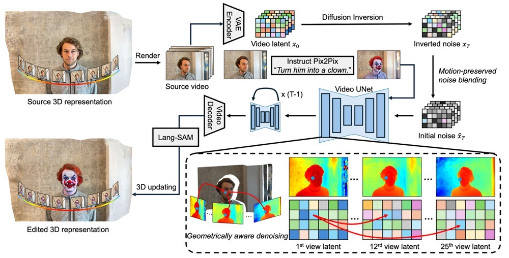

<div align="center">
<h1>ViP3DE: Fast Multi-view Consistent 3D Editing with Video Priors</h1>

<h3 align="center"><b>AAAI 2026</b></h3>

[**Chen Liyi**](https://scholar.google.com/citations?user=nMev-10AAAAJ&hl=zh-CN) · [**Li Ruihuang**](https://scholar.google.com/citations?user=8CfyOtQAAAAJ&hl=zh-CN) · [**Zhang Guowen**](https://scholar.google.com/citations?user=DxcLKZIAAAAJ&hl=en) · [**Wang Pengfei**](https://scholar.google.com/citations?user=zAAYwRYAAAAJ&hl=en) · [**Lei Zhang**](https://www4.comp.polyu.edu.hk/~cslzhang/)<sup>&dagger;</sup>
<br>

The Hong Kong Polytechnic University 
<br>
&dagger;Corresponding author

<a href="https://arxiv.org/abs/xxxx.xxxxx"></a>
<a href="https://mt-cly.github.io/ViP3DE/"></a>

</div>

## 📖 Overview

**ViP3DE** (Video Priors for 3D Editing) is a fast and multi-view consistent 3D editing framework that leverages video diffusion priors for high-quality 3D Gaussian Splatting editing. Our method achieves state-of-the-art editing quality while maintaining strong multi-view consistency.



## 🎉 News
- **2025-11:** ViP3DE is accepted by AAAI 2026. 🎉
- **2025-11:** Code is released.


## ⚙️ Installation

### Prerequisites
- Python >= 3.10
- PyTorch >= 2.0
- CUDA Toolkit >= 11.8

### Setup Environment

```bash
git clone https://github.com/mt-cly/ViP3DE.git
cd ViP3DE

# Create conda environment from environment.yml
conda env create -f environment.yml
conda activate vip3de

# Install 3D Gaussian Splatting submodules
pip install gaussiansplatting/submodules/diff-gaussian-rasterization
pip install gaussiansplatting/submodules/simple-knn
```

### Download Pretrained Models

Download the following pretrained models and place SVD-XT weight `svd_xt.safetensors` in the `checkpoints/` directory:

| Model | Description | Download |
|:---:|:---:|:---:|
| SVD-XT | Stable Video Diffusion XT | [Hugging Face](https://huggingface.co/stabilityai/stable-video-diffusion-img2vid-xt) |


## 📁 Data Preparation

### Data Structure

Your input data should be organized as follows:

```
data/
├── <scene_name>/
│   ├── images/           # Input multi-view images
│   │   ├── frame_00001.jpg
│   │   ├── frame_00002.jpg
│   │   └── ...
│   ├── sparse/           # COLMAP sparse reconstruction
│   │   └── 0/
│   │       ├── cameras.txt
│   │       ├── images.txt
│   │       └── points3D.txt (or points3D.ply)
│   └── gaussians/        # Pre-trained 3D Gaussian Splatting results
│       ├── cameras.json
│       ├── cfg_args
│       ├── input.ply
│       └── point_cloud/
│           └── iteration_30000/
│               └── point_cloud.ply
```
We provide three reconstructed scenes which contain continuous frames.

## 🚀 Usage

### Quick Start

We provide demo scripts in the `demo/` folder:

```bash
# Edit a face to Spider-Man
bash demo/face_Turn_him_into_a_spider_man_with_mask.sh

# Turn a person into a robot
bash demo/person_Turn_him_into_a_robot.sh

# Make T-Rex on fire
bash demo/trex_Make_it_on_fire.sh
```

### Custom Editing

Run ViP3DE with your own scene and editing prompt:

```bash
python launch.py --config configs/vip3de.yaml --train \
    trainer.max_steps=600 \
    trainer.val_check_interval=600 \
    system.prompt_processor.prompt="<your editing instruction>" \
    data.source="./data/<scene_name>/" \
    data.max_view_num=48 \
    data.height=512 \
    data.width=768 \
    system.gs_source="./data/<scene_name>/gaussians/point_cloud/iteration_30000/point_cloud.ply" \
    system.source_prompt="<description of original scene>" \
    system.target_prompt="<description of target scene>" \
    system.guidance.inverse_alpha=0.15 \
    system.seg_prompt="<segmentation prompt (optional)>"
```

## 📊 Results

Results will be saved to `outputs/vip3de/<scene_name>-<prompt>/`:


## �� Citation

If you find this work useful, please cite our paper:

```bibtex
@inproceedings{chen2026vip3de,
  title={Fast Multi-view Consistent 3D Editing with Video Priors},
  author={Chen, Liyi and others},
  booktitle={Proceedings of the AAAI Conference on Artificial Intelligence},
  year={2026}
}
```

## 🙏 Acknowledgement

This project is built upon the following excellent works:
- [3D Gaussian Splatting](https://github.com/graphdeco-inria/gaussian-splatting)
- [Stable Video Diffusion](https://github.com/Stability-AI/generative-models)
- [InstructPix2Pix](https://github.com/timbrooks/instruct-pix2pix)
- [threestudio](https://github.com/threestudio-project/threestudio)
- [DGE](https://github.com/silent-chen/DGE)
- [LangSAM](https://github.com/luca-medeiros/lang-segment-anything)

## 📜 License

This project is licensed under the MIT License - see the [LICENSE](LICENSE) file for details.
